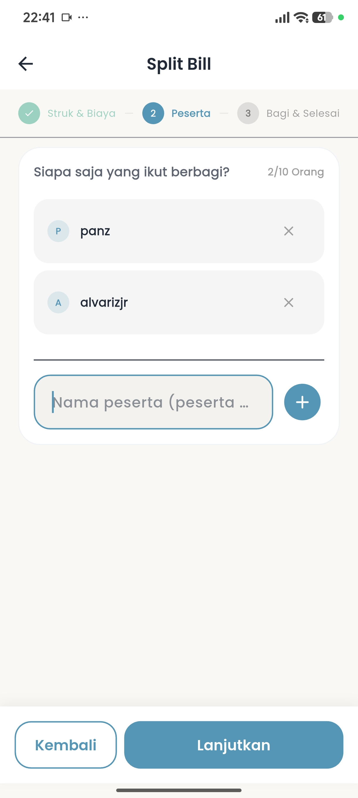
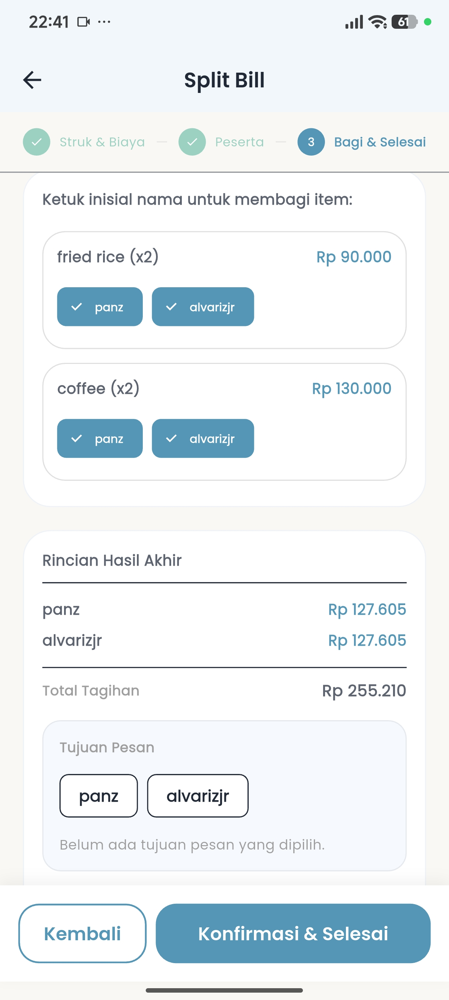
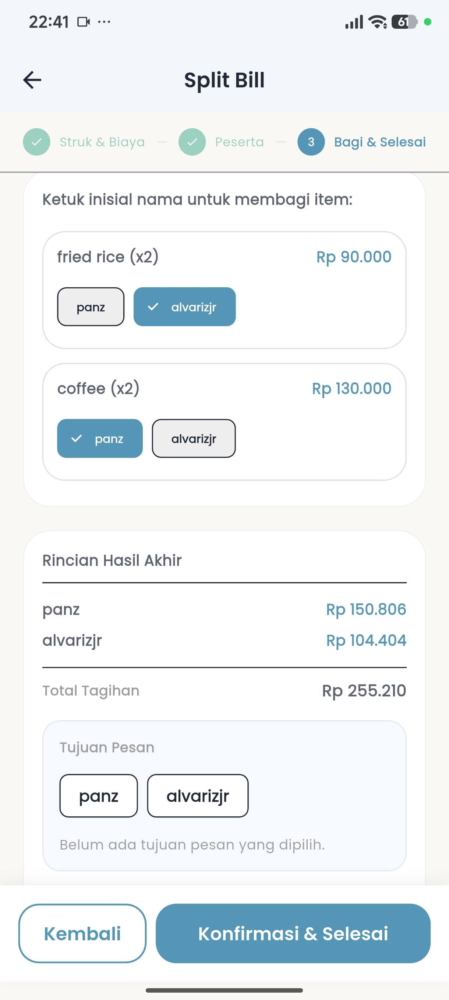
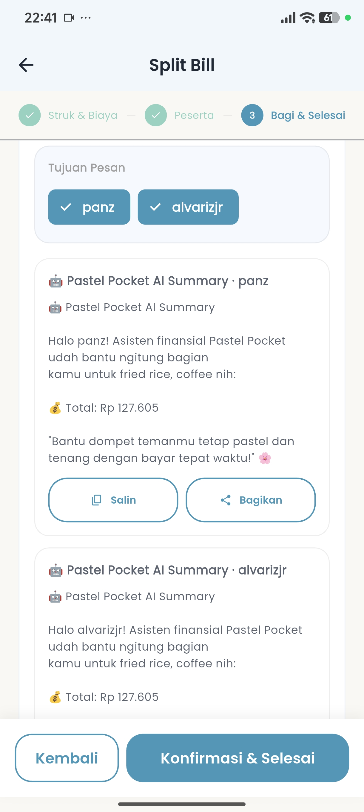

# 💰 Pastel Pockets

### 🤖 AI-Powered Personal Finance Consultant

Pastel Pockets helps you keep everyday finances organized with a clear view of
transactions, wallets, budgets, savings goals, and spending reports. This
Android pre-release demo is for evaluation; it is not a finished financial
advice service.

**Current status:** PROD Pre-Release Demo
**Platform:** Android
**Android application ID:** `com.pastel.wallet`

## 🧭 What you can try

- Review income, expenses, balances, and spending reports.
- Record and organize transactions, then search or filter transaction history.
- Manage wallets, budgets, and savings goals.
- Import and export transactions as CSV files.
- Use the app as a guest or sign in with Google.
- Explore AI-assisted financial insights and forecasts based on information in
  the app.

The conversational AI chatbot is **coming soon** in this PROD demo. AI-generated
insights are informational and should be checked against your own records.

## 🛠️ Technology Stack

The Android PROD APK and application paths were inspected separately from the
wider development and machine-learning workspace. Bundled dependencies do not
by themselves prove that a related external service is available.

| Technology | Role | PROD Status | Current Development |
| --- | --- | --- | --- |
| Flutter and Dart | Android app UI, navigation, and financial calculations | Production runtime | Core app runtime; financial reports and projections are computed in Dart. |
| Kotlin | Android Flutter host and platform integration | Production platform integration | Supporting integration; no separate optimization claim. |
| Firebase Authentication and Cloud Firestore | Google sign-in, account profile, and cloud synchronization | Production integration | Identity, session, and synchronization reliability are covered by targeted tests. |
| Isar | Local application database | Production | Local data scoping and cloud-sync durability are covered by tests. |
| Google Sign-In and `local_auth` | Account sign-in and biometric unlock | Production platform integrations | Supporting authentication integrations. |
| Google ML Kit Text Recognition | Receipt text recognition | Bundled integration; Smart Receipt OCR is marked coming soon in this PROD demo | Receipt parsing and extraction quality are evaluated in development; the OCR route is gated in this release. |
| Riverpod, `go_router`, and `fl_chart` | State management, app navigation, and report charts | Supporting production runtime | Supporting app architecture and presentation. |
| Agentic AI API client | Sends verified financial context for an optional AI-generated narrative; the app also has a local Dart fallback | Client path is present; a live PROD endpoint and serving model were not verified, and the endpoint is unset by default | Grounding, structured-response validation, fallback behavior, and AI evaluation are covered by development tests. |

### 💻 Programming Languages

| Language | Role in the project | Evidence status |
| --- | --- | --- |
| Dart | Core Flutter mobile application and on-device financial logic | Android PROD runtime verified in the inspected APK. |
| Kotlin | Android host activity and platform channel integration | Production platform integration verified in the inspected APK. |
| Java | Generated Android plugin-registration glue | Supporting integration included in the inspected APK; not app business logic. |
| Python | Separate Streamlit analytics/ML application, model-training experiments, and offline evaluation tools | Engineering/research use only; not part of the Flutter mobile runtime. |
| Swift | iOS runner entry point | iOS source exists, but no iOS production archive or device runtime was verified; this release is Android-only. |
| Objective-C | Generated iOS plugin-registration glue | iOS source only; no iOS production archive or device runtime was verified. |

C/C++ runner source in the wider project targets desktop platforms and is not
claimed as part of the Android mobile runtime. Native libraries supplied by
Flutter or its plugins are not evidence of project-authored C/C++ app logic.

### 🤖 AI & Machine Learning

Financial aggregation and deterministic balance projections in the mobile app
run in Dart. The AI Insights screen can send verified facts through an external
API client for a narrative and uses a local, verified fallback; the inspected
PROD configuration does not establish a live AI service or model. No Python
interpreter or Qwen model weights were found in the inspected APK.

Python is used separately in the project's Streamlit analytics/ML application,
ML training and evaluation work, and offline OCR benchmarking. QLoRA belongs to
model experimentation/training, not mobile inference. Qwen/Ollama work in that
separate environment should not be mistaken for an embedded mobile model or a
verified PROD AI backend.

### 🔬 Current Development & Optimization

| Area | Current focus |
| --- | --- |
| AI insights | Evaluating grounded financial facts, structured responses, validation, and deterministic fallback behavior. |
| Data and synchronization | Testing identity-scoped data handling and durable synchronization behavior. |
| Authentication | Testing Google initialization, session handling, and biometric access policies. |
| Receipt extraction | Evaluating capture quality, structured parsing, and extraction accuracy; the PROD OCR route remains marked coming soon. |

These items describe engineering and evaluation work in the project, not a
claim that an external AI service is deployed or that gated features are
available in this release.

## 🚧 Development status

| Status | Details |
| --- | --- |
| Available in this demo | Transaction tracking, wallet management, budgets, savings goals, reports, CSV import/export, Google sign-in, Guest access, and AI-assisted insights. |
| In development | Receipt scanning/OCR and conversational AI are marked as coming soon in the PROD app. Split Bill is not included as an available PROD demo feature. |
| Planned | Further improvements will be guided by demo feedback. No additional feature dates are promised. |

## 📥 Download

Download the Android pre-release APK from the
[Pastel Pockets v0.1.0 GitHub Release](https://github.com/ivanalvarizjr/pastel_pockets_release/releases/tag/v0.1.0).
Verify the APK against the SHA-256 checksum in
[`checksums/SHA256SUMS.txt`](checksums/SHA256SUMS.txt).

## 🖼️ Screenshots

### Demo financial data

Financial balances, amounts, transactions, and other financial values visible
in these screenshots are fictional demonstration data created specifically for
this project. They do not represent real personal financial information. The
data is intentionally controlled and constructed to show the application's
financial workflows and progress in a realistic scenario, allowing prospective
users, reviewers, developers, and other viewers to understand how the
application appears and behaves without exposing real financial information.
These values must not be interpreted as actual financial records, balances,
transactions, or financial advice. Names and initials shown in the Split Bill
screenshots are the developer's own demo name or fictional initials, not
another person's private identity.

### 🔐 Authentication

#### Login

Choose Google sign-in or continue in Guest mode from the welcome screen.

#### Biometric unlock

The unlock screen offers a biometric prompt for a returning session.

### 📊 Dashboard and wallets

#### Dashboard overview

The dashboard brings together the displayed balance, monthly cash flow, quick
actions, and navigation to key areas.

#### Wallets and dashboard insights

This dashboard view shows wallet cards, an AI insight, budget progress, and the
start of recent activity.

#### Budget progress and recent activity

The lower dashboard view focuses on budget progress and a list of recent
transactions.

### 💳 Transactions, budgets, and savings

#### Transactions

Search, income/expense filters, category filters, and transaction entries are
visible on this screen.

#### Budgets

Budget cards show category spending, progress against limits, and remaining
amounts.

#### Saving goals

A saving goal card displays its target, progress, remaining amount, and an
action to add savings.

### 📈 Reports

#### Cash flow report

The report summarizes net cash flow, income, expenses, and a period-based trend
chart.

#### Expense categories

This scrolled report view shows the cash-flow trend alongside a category
breakdown of expenses.

### 🧰 Financial tools

#### AI financial insights

The insights screen presents a forecast summary, selectable time horizons, and
a projected-balance chart.

#### Split Bill: items and charges

This captured workflow preview shows receipt items, item entry controls, and
tax and service-charge fields; Split Bill is not an available feature in this
PROD demo.

#### Split Bill: participants

The participant step lists the demo participants before assigning receipt
items.

#### Split Bill: item distribution

This result view shows receipt items assigned to participants and their
calculated shares.

#### Split Bill: distribution breakdown

The breakdown view shows a different item-to-participant assignment and the
resulting totals.

#### Split Bill: sharing

The sharing view shows prepared participant summaries with copy and share
actions.

### ⚙️ Settings

#### General settings

Settings include appearance, biometric login, notifications, CSV import/export,
language, and currency options.

### 🚀 Development progress

#### Smart Receipt OCR

The screen presents receipt OCR as a coming-soon feature in this PROD demo.

## ⚠️ Known limitations

- This is a pre-release demo and may change; back up important records.
- Android is the only platform provided by this release.
- Receipt OCR, Split Bill, and conversational AI chatbot functionality are not
  available in this PROD demo.
- The app is a personal organization tool, not a bank, tax service, or
  substitute for qualified financial advice. Review all entries and decisions
  yourself.

## 📛 Project names

**Pastel Wallet** is the development/source project. **Pastel Pockets** is the
public Android application.

## ⚖️ Disclaimer

Pastel Pockets is provided for demonstration and personal organization only.
Financial insights are not a recommendation to buy, sell, borrow, invest, or
take any other financial action. You are responsible for verifying your data
and decisions.
