# Pastel Pockets

### AI-Powered Personal Finance Consultant

Pastel Pockets helps you keep everyday finances organized with a clear view of
transactions, wallets, budgets, savings goals, and spending reports. This
Android pre-release demo is for evaluation; it is not a finished financial
advice service.

**Current status:** PROD Pre-Release Demo
**Platform:** Android
**Android application ID:** `com.pastel.wallet`

## What you can try

- Review income, expenses, balances, and spending reports.
- Record and organize transactions, then search or filter transaction history.
- Manage wallets, budgets, and savings goals.
- Import and export transactions as CSV files.
- Use the app as a guest or sign in with Google.
- Explore AI-assisted financial insights and forecasts based on information in
  the app.

The conversational AI chatbot is **coming soon** in this PROD demo. AI-generated
insights are informational and should be checked against your own records.

## Languages & Technologies

### Programming & Platform Languages

The maintained application source was inspected directly. Generated files,
build outputs, caches, and tests were excluded from this inventory.

| Language | Verified use |
| --- | --- |
| Dart | Main Flutter application code in 56 maintained `lib/` files (approximately 996 KB). |
| Kotlin | Android platform activity and native integration (1 maintained file, approximately 15 KB). |
| Swift | iOS and macOS platform entry points (3 maintained files, approximately 1 KB). |
| C++ | Windows and Linux desktop runner code, including native headers (10 maintained files, approximately 24 KB). |

### Build & Configuration

| Technology / format | Verified use |
| --- | --- |
| Flutter | Cross-platform application framework and asset/build integration. |
| Gradle Kotlin DSL (`.kts`) | Android build, flavors, dependencies, and release configuration. |
| CMake | Windows and Linux desktop runner build configuration. |
| YAML | Dart/Flutter package manifest and project configuration. |
| XML | Android manifests and Android resources. |
| JSON | Firebase client configuration, web metadata, and application data fixtures. |
| Property lists (`.plist`) | Apple platform application metadata and configuration. |
| Properties files | Android/Gradle local and project settings. |

The inventory reports file counts and approximate source size only; no
cross-language percentage is presented because platform wrappers and native
header/source files are not directly comparable.

## Development status

| Status | Details |
| --- | --- |
| Available in this demo | Transaction tracking, wallet management, budgets, savings goals, reports, CSV import/export, Google sign-in, Guest access, and AI-assisted insights. |
| In development | Receipt scanning/OCR and conversational AI are marked as coming soon in the PROD app. Split Bill is not included as an available PROD demo feature. |
| Planned | Further improvements will be guided by demo feedback. No additional feature dates are promised. |

## Download

Download the Android pre-release APK from the
[Pastel Pockets v0.1.0 GitHub Release](https://github.com/ivanalvarizjr/pastel_pockets_release/releases/tag/v0.1.0).
Verify the APK against the SHA-256 checksum in
[`checksums/SHA256SUMS.txt`](checksums/SHA256SUMS.txt).

## Screenshots

### Demo financial data

Financial balances, amounts, transactions, and other financial values visible
in these screenshots are fictional demonstration data created specifically for
this project. They do not represent real personal financial information. The
data is intentionally controlled and constructed to show the application's
financial workflows and progress in a realistic scenario, allowing prospective
users, reviewers, developers, and other viewers to understand how the
application appears and behaves without exposing real financial information.
These values must not be interpreted as actual financial records, balances,
transactions, or financial advice.

### Authentication

#### Login

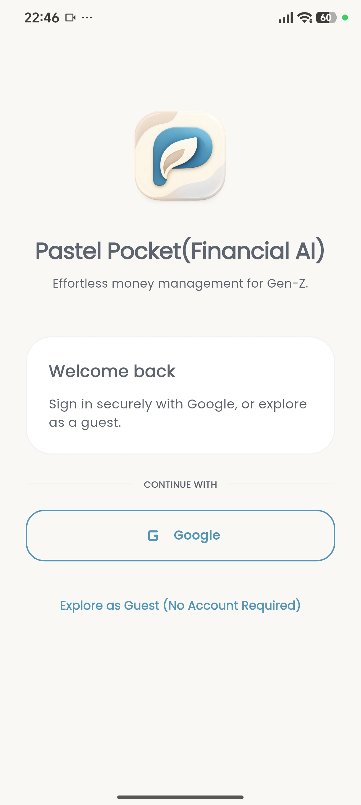

Choose Google sign-in or continue in Guest mode from the welcome screen.

#### Biometric unlock

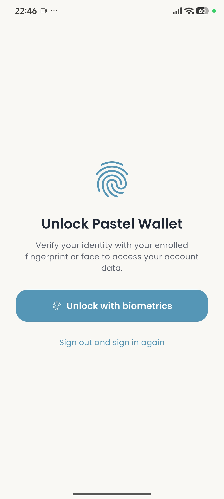

The unlock screen offers a biometric prompt for a returning session.

### Dashboard and wallets

#### Dashboard overview

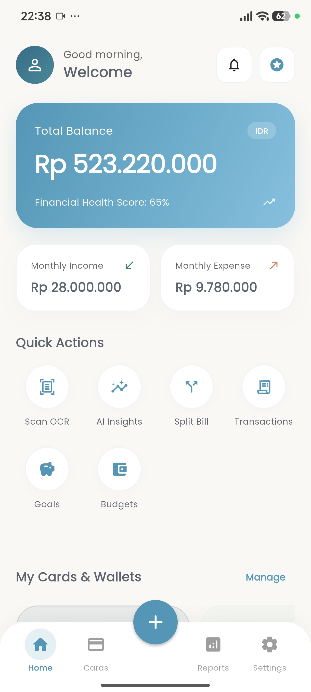

The dashboard brings together the displayed balance, monthly cash flow, quick
actions, and navigation to key areas.

#### Wallets and dashboard insights

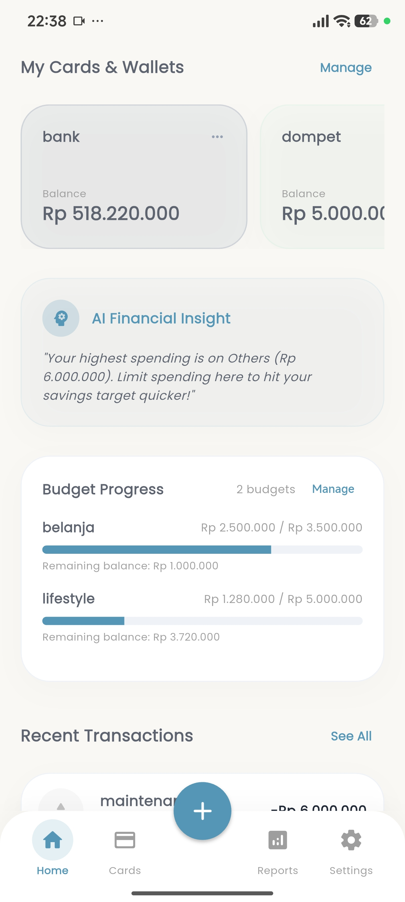

This dashboard view shows wallet cards, an AI insight, budget progress, and the
start of recent activity.

#### Budget progress and recent activity

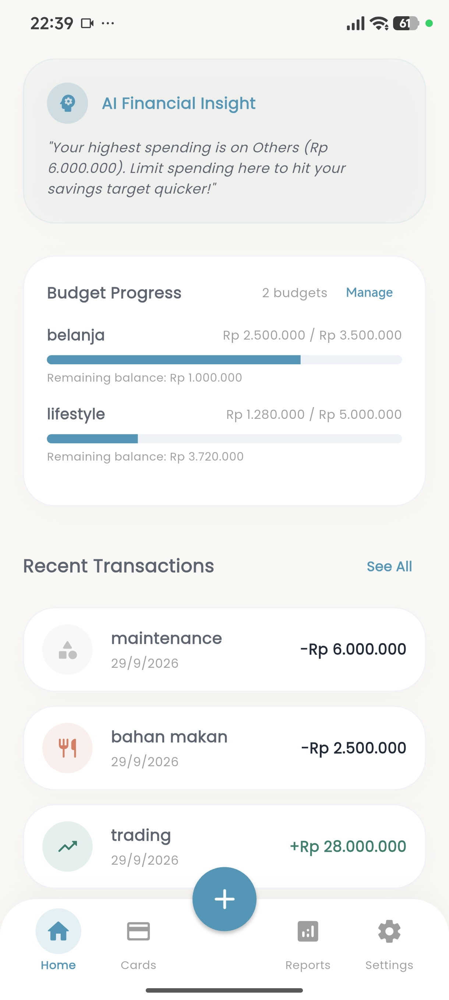

The lower dashboard view focuses on budget progress and a list of recent
transactions.

### Transactions, budgets, and savings

#### Transactions

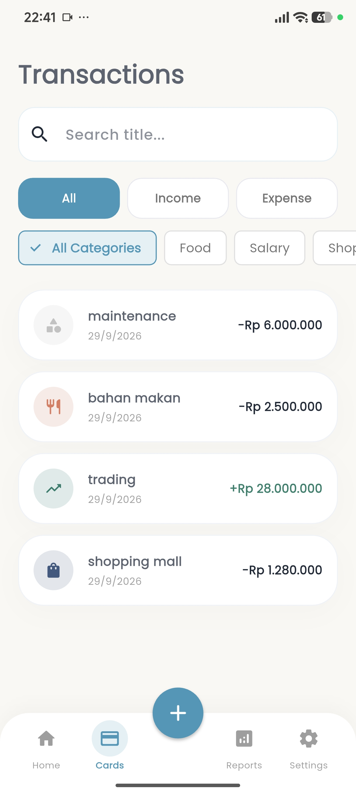

Search, income/expense filters, category filters, and transaction entries are
visible on this screen.

#### Budgets

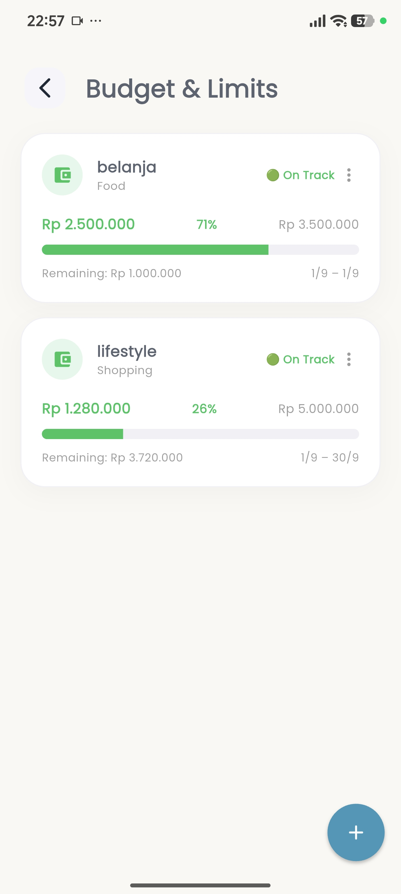

Budget cards show category spending, progress against limits, and remaining
amounts.

#### Saving goals

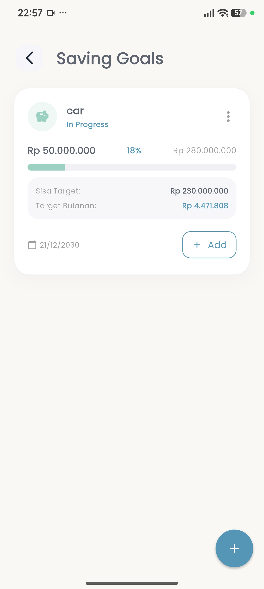

A saving goal card displays its target, progress, remaining amount, and an
action to add savings.

### Reports

#### Cash flow report

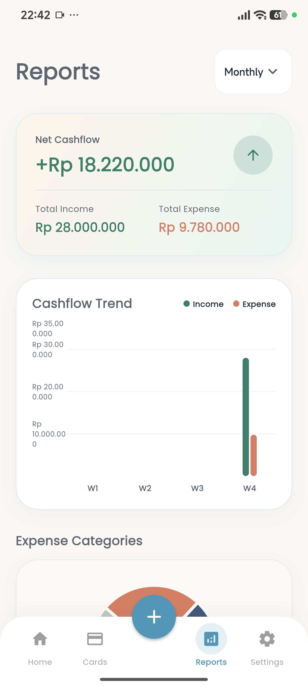

The report summarizes net cash flow, income, expenses, and a period-based trend
chart.

#### Expense categories

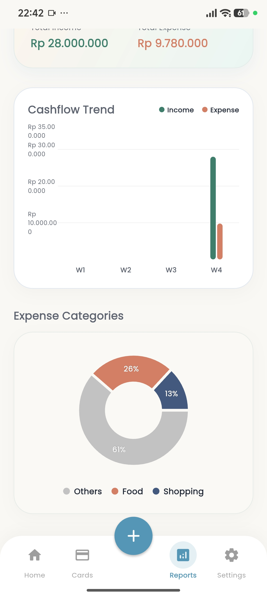

This scrolled report view shows the cash-flow trend alongside a category
breakdown of expenses.

### Financial tools

#### AI financial insights

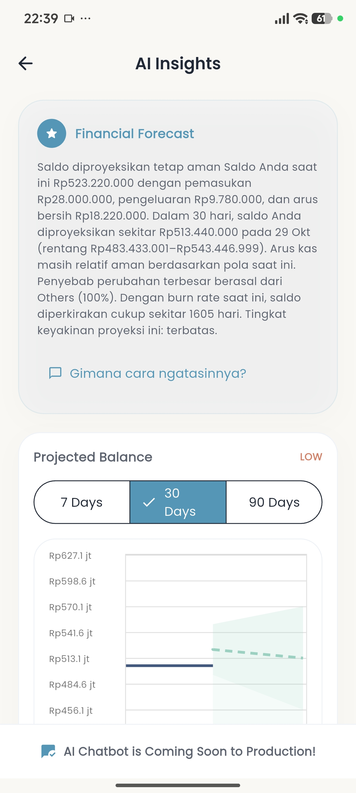

The insights screen presents a forecast summary, selectable time horizons, and
a projected-balance chart.

#### Split Bill: items and charges

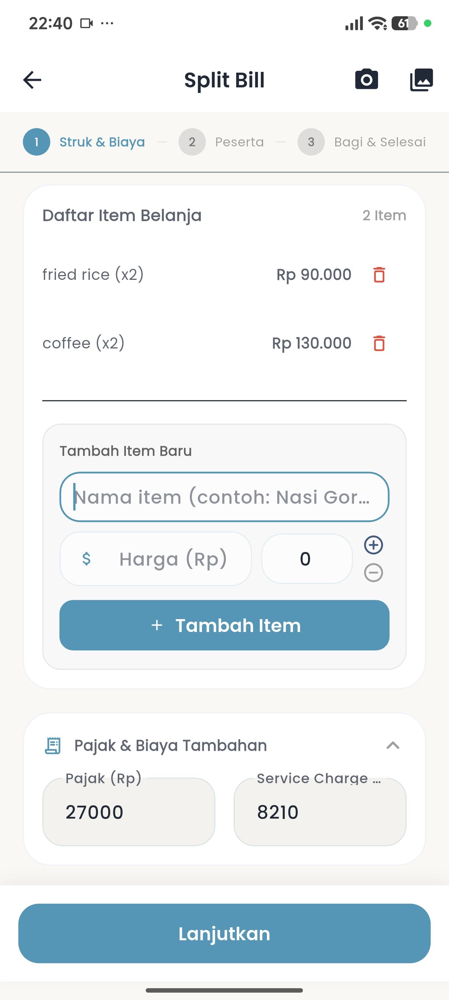

This captured workflow preview shows receipt items, item entry controls, and
tax and service-charge fields; Split Bill is not an available feature in this
PROD demo.

### Settings

#### General settings

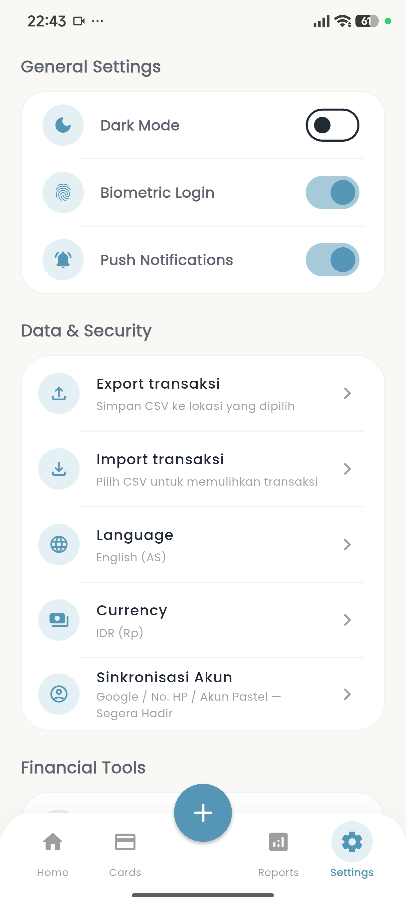

Settings include appearance, biometric login, notifications, CSV import/export,
language, and currency options.

### Development progress

#### Smart Receipt OCR

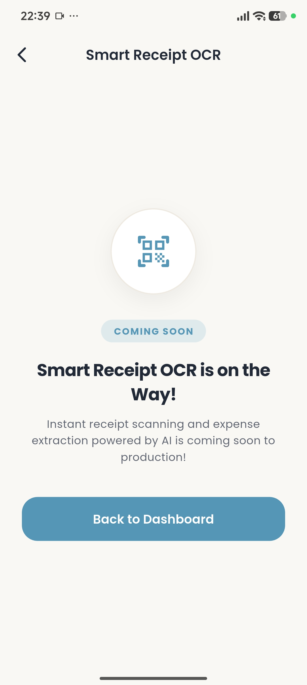

The screen presents receipt OCR as a coming-soon feature in this PROD demo.

Screenshots showing unverified personal identifiers are intentionally not
included.

## Technology

Pastel Pockets is built with Flutter and Dart and uses Firebase services for
account-related functionality.

## Known limitations

- This is a pre-release demo and may change; back up important records.
- Android is the only platform provided by this release.
- Receipt OCR, Split Bill, and conversational AI chatbot functionality are not
  available in this PROD demo.
- The app is a personal organization tool, not a bank, tax service, or
  substitute for qualified financial advice. Review all entries and decisions
  yourself.

## Project names

**Pastel Wallet** is the development/source project. **Pastel Pockets** is the
public Android application.

## Disclaimer

Pastel Pockets is provided for demonstration and personal organization only.
Financial insights are not a recommendation to buy, sell, borrow, invest, or
take any other financial action. You are responsible for verifying your data
and decisions.
